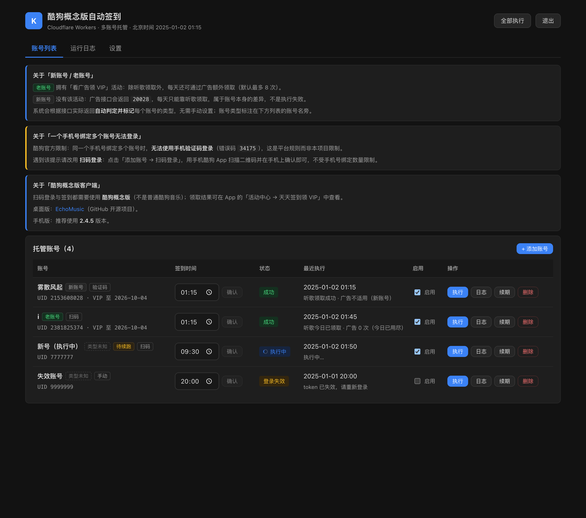
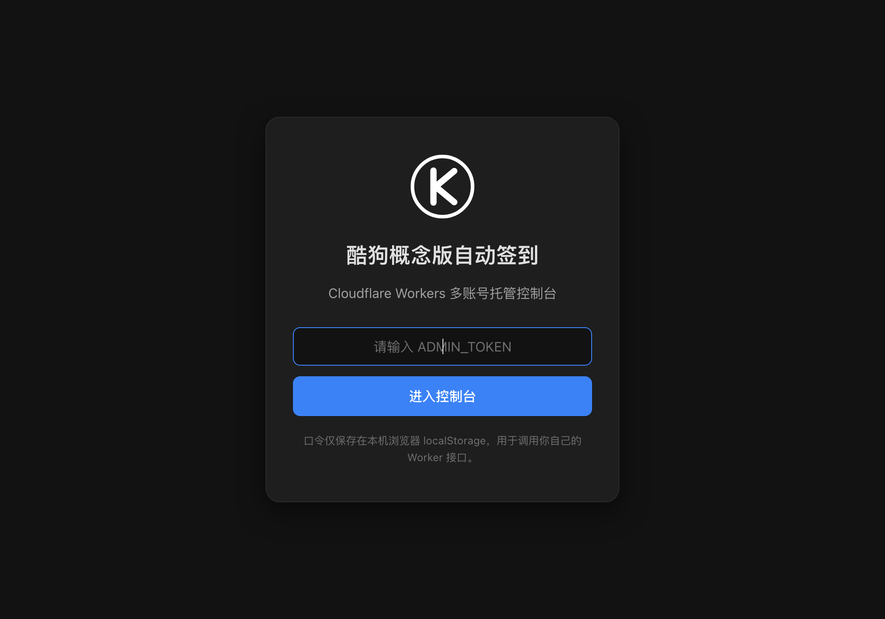
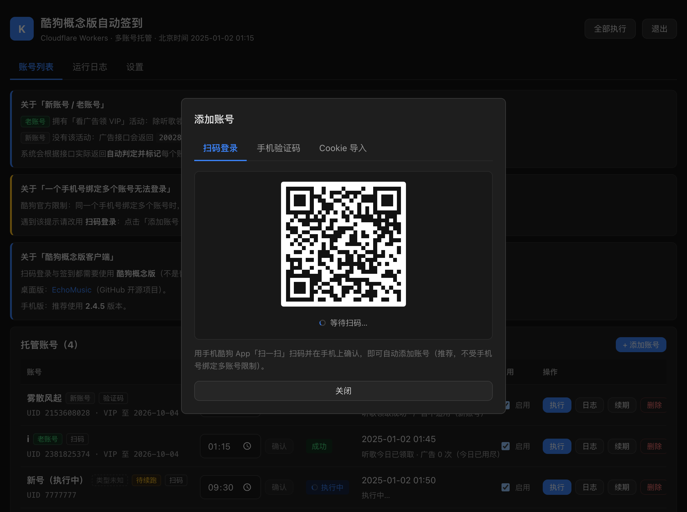
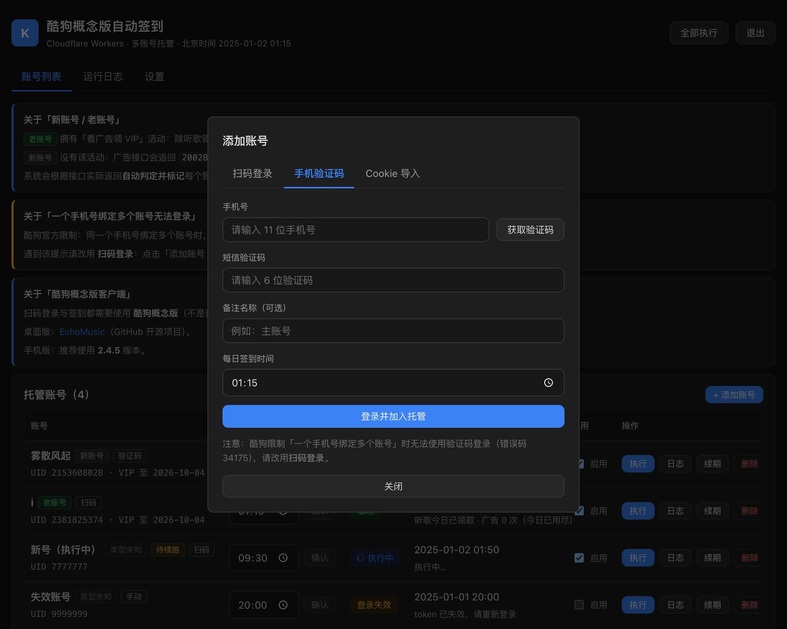
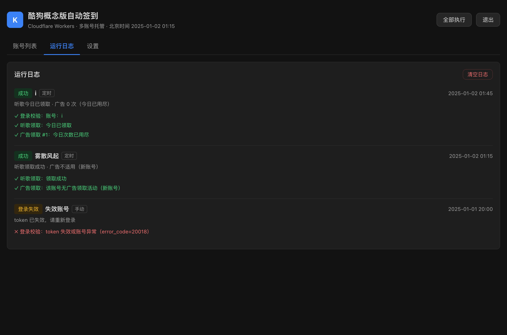
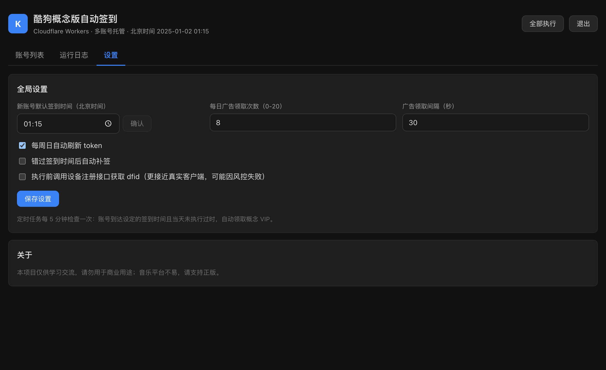
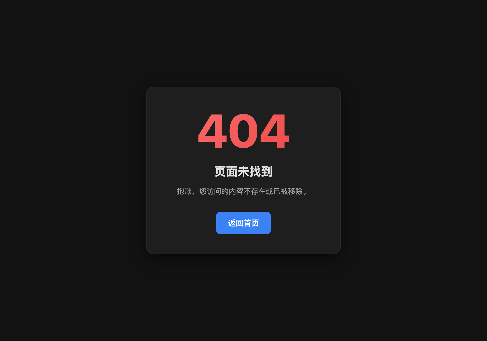

# 酷狗概念版自动签到


> 部署在 **Cloudflare Workers** 上的多账号自动签到服务 · 图形化控制台 · 手机验证码登录 · 扫码登录




**无需服务器、无需本地环境、无需 GitHub Actions** —— 在 Cloudflare 网页控制台粘贴一份 JS 代码、
绑定一个 KV 命名空间，就能拥有一个带图形界面的多账号托管面板。

> ⚠️ 本项目仅供学习与技术研究使用，请勿用于商业用途。音乐平台不易，请支持正版。

---

## ✨ 功能

| 功能 | 说明 |
| --- | --- |
| 🖥 图形化控制台 | 暗色调单页界面，零 CDN 依赖，手机浏览器同样可用 |
| 👥 多账号托管 | 账号保存在 Cloudflare KV，可分别设置签到时间、单独启用/停用 |
| 📷 扫码登录 | 页面内展示酷狗官方二维码，手机 App 扫码即完成登录（**推荐**） |
| 📱 手机验证码登录 | 页面内直接发送验证码并登录，自动加入托管 |
| 🍪 Cookie 导入 | 已有 `token` + `userid` 可直接导入，导入时自动校验 |
| 🏷 新老账号识别 | 按接口返回自动判定「老账号（有广告领取活动）/ 新账号」，首页附说明 |
| ⏰ 定时自动签到 | Cron 每 5 分钟检查一次，到点自动领取，错过可补签 |
| 🎁 完整领取流程 | 听歌领取 + 广告领取（默认 8 次）+ VIP 到期时间回写 |
| 🔄 token 自动续期 | 每周日自动刷新 token，也可手动续期 |
| 🔐 双重安全 | `ADMIN_TOKEN` 接口鉴权 + `SECRET_KEY` 加密 KV 中的账号 token |
| 📜 运行日志 | 保留最近 100 条记录与分步明细，失败原因一目了然 |
| 🚫 自定义 404 | 未知路径返回同风格错误页，另附 `robots.txt` 禁止收录 |

---

## 🚀 部署（Cloudflare 网页版）

全程只需要浏览器，不用安装任何东西。预计 3 分钟。

### 第 1 步：创建 Worker

1. 打开 [Cloudflare 控制台](https://dash.cloudflare.com/) 并登录
2. 左侧选择 **计算（Workers）→ Workers 和 Pages**
3. 点击 **创建应用程序 → 创建 Worker**
4. 随便起个名字（例如 `kg-qiandao`），点击 **部署**

### 第 2 步：粘贴代码

1. 部署完成后点击 **编辑代码**（Edit code）
2. 打开本仓库的 [`worker.js`](./worker.js)，**全选复制全部内容**
3. 粘贴到编辑器里，**覆盖原有的示例代码**
4. 点击右上角 **部署**（Deploy）

> `worker.js` 是打包好的单文件版本，已经把全部源码和加密算法内联进去，不需要任何额外文件。

### 第 3 步：创建 KV 命名空间

1. 左侧选择 **存储和数据库 → KV**
2. 点击 **创建命名空间**，名称填 `your_worker_name`（名字随意）

### 第 4 步：把 KV 绑定到 Worker

1. 回到 **Workers 和 Pages**，进入刚才创建的 Worker
2. 打开 **设置 → 绑定**（Settings → Bindings）
3. 点击 **添加 → KV 命名空间**
4. **变量名称必须填写 `KG_KV`**（区分大小写，写错会提示未绑定）
5. 选择第 3 步创建的命名空间，保存

> 保存后需要重新部署一次生效，按提示操作即可。

### 第 5 步：设置管理口令

1. 在 Worker 的 **设置 → 变量和机密**（Variables and Secrets）
2. 点击 **添加**，类型选择 **机密 / Secret**
3. 名称填 `ADMIN_TOKEN`，值填一个你自己的复杂口令（这就是控制台登录密码）
4. 保存并重新部署

可选：再添加一个名为 `SECRET_KEY` 的机密，用于加密 KV 中保存的账号 token。
**注意：`SECRET_KEY` 一旦设置就不要更改**，否则已保存的账号需要重新登录。

### 第 6 步：添加定时触发器（自动签到必需）

1. 在 Worker 的 **设置 → 触发事件 → Cron 触发器**
2. 点击 **添加 Cron 触发器**，表达式填写：

   ```
   */5 * * * *
   ```

3. 保存

这表示每 5 分钟检查一次，账号到达设定的签到时间且当天未执行过时自动领取。

### 第 7 步：开始使用

1. 打开 Worker 的访问地址（形如 `https://kg-qiandao.<你的子域>.workers.dev`）
2. 输入第 5 步设置的 `ADMIN_TOKEN` 进入控制台
3. 点击 **添加账号**，推荐用 **扫码登录**
4. 调整每个账号的签到时间（北京时间），到点后会自动执行；想立即验证可点该账号的 **执行**

---

## 📸 界面预览

### 登录页



### 扫码登录（推荐）

用手机酷狗概念版 App 扫码并在手机上确认即可，不受手机号绑定数量限制。



### 手机验证码登录



### 运行日志

每一步的成功与失败原因都记录下来，失败会带上酷狗返回的原始错误信息。



### 全局设置



### 自定义 404



---

## 🧭 使用说明

### 账号列表

- **账号名后的标签**：`老账号` / `新账号` / `类型未知`，由接口返回自动判定。
  - 老账号拥有「看广告领 VIP」活动，除听歌外每天还能通过广告额外领取（默认最多 8 次）
  - 新账号没有该活动（广告接口返回 `20028`），每天只能靠听歌领取，这是账号本身的差异，不是故障
- **签到时间**：改动后「确认」按钮会变成**绿色**，点击才保存（不会自动提交），输入框内按回车等效
- **操作**：`执行`（立即跑一次，页面会等待并显示结果）、`日志`（展开分步明细）、
  `续期`（手动刷新 token）、`删除`
- **待续跑 / 待重试**：广告次数没领完或听歌未领到时出现，定时任务会自动继续，无需人工干预

### 定时任务怎么工作

- 每 5 分钟检查一次：账号到达签到时间且**当天未执行过**时自动执行
- 单次执行有时间上限，8 次广告领取会分摊到多次执行中自动续跑
  （8 次 × 30 秒间隔 ≈ 3.5 分钟，一次跑完会被平台中断）
- 同一天最多自动重试 3 次，可在设置里开启「错过签到时间后自动补签」

### 全局设置

| 设置项 | 默认 | 说明 |
| --- | --- | --- |
| 新账号默认签到时间 | `01:15` | 北京时间，24 小时制 |
| 每日广告领取次数 | `8` | 酷狗「看广告领 VIP」上限，`0` 表示只做听歌领取 |
| 广告领取间隔 | `30` 秒 | 每次广告领取之间的等待时间 |
| 每周日自动刷新 token | 开 | 与常见做法一致 |
| 错过时间自动补签 | 关 | 开启后当天错过的账号会在后续 Cron 补跑 |
| 执行前设备注册获取 dfid | 关 | 更接近真实客户端，但可能引入额外失败点 |

---

## ❓ 常见问题

**Q：扫码后一直显示「等待扫码」？**
二维码有效期只有几分钟，过期后点「刷新二维码」即可；必须用手机**酷狗概念版** App 扫码并在手机上确认。

**Q：手机验证码登录提示「该手机号绑定了多个账号」？**
酷狗官方限制（错误码 `34175`），这种情况无法用验证码登录，请改用**扫码登录**。

**Q：广告领取提示「该账号无广告领取活动（新账号）」？**
不是故障。酷狗的「看广告领 VIP」只对老账号开放，新账号调用会返回 `20028`。
系统会自动把它标记为 `新账号`，并识别为账号属性而非执行失败。可在 App 的
「活动中心 → 天天签到领 VIP」确认该账号是否有此活动入口。

**Q：听歌领取失败，提示 `error_code=30002 GET LOCK FIAL`？**
这是酷狗的**并发锁竞争**（`FIAL` 是官方拼写错误，实为 `FAIL`），说明同一账号在同一时刻被发起了
多次领取请求（比如你手动点了执行、同时定时任务也在跑）。项目已做三层处理：同账号禁止并发执行、
听歌遇到锁竞争自动等 3 秒重试一次、仍失败则标记 `待重试` 由定时任务继续。**无需手动处理**。

**Q：账号一直显示「执行中」？**
正常执行最长约 2 分钟（定时任务）或 45 秒（手动执行）。超过 3 分钟仍显示执行中，界面会自动
纠正为「失败」并提示，随后定时任务会重新执行。

**Q：接口返回 403「服务端未配置 ADMIN_TOKEN」？**
说明第 5 步没有完成，或者添加后没有重新部署。

**Q：KV 绑定后仍提示未绑定？**
检查绑定名称是否**严格等于** `KG_KV`，并且保存后重新部署了一次。

**Q：免费版 Worker 够用吗？**
够用。Cron 触发器与 KV 免费额度对个人多账号场景绰绰有余。

---

## 🛠 本地开发（可选）

如果你不想用网页版，或者想修改源码：

```bash
npm install
cp .dev.vars.example .dev.vars   # 填入 ADMIN_TOKEN
npx wrangler kv namespace create KG_KV   # 把输出的 id 填进 wrangler.toml
npm run dev                      # http://127.0.0.1:8787
npm run deploy                   # 部署到 Cloudflare
```

### 测试

```bash
npm test          # 加密/KV/调度/签到流程/前端渲染（离线，共 241 项）
npm run test:live # 联调酷狗线上接口（需要联网）
node test/preview.mjs /tmp/a.html login   # 生成静态预览页，浏览器直接看 UI
node test/screenshots.mjs                 # 重新生成 screenshots/ 下的展示截图
```

### 目录结构

```
worker.js            单文件版（网页控制台用这个）
src/
├── index.js         Worker 入口：路由 + 鉴权 + 定时任务
├── tasks.js         签到编排、时间预算、续跑、token 续期
├── store.js         KV 读写与敏感字段加解密
├── api/             酷狗登录 / 签到接口
├── lib/             MD5 / AES / RSA / 签名 / 设备指纹（纯 JS，无 Node 依赖）
└── web/ui.js        控制台页面
test/                测试、预览与截图工具
```

### 实现要点

酷狗接口需要一套自有的签名与加密流程（MD5 签名、AES-CBC 登录参数、RSA 加密、设备指纹）。
Cloudflare Workers 的 WebCrypto **没有 MD5**，且各运行时对 AES-CBC 的填充行为并不一致
（Node 会自动 PKCS7 填充，workerd 严格按规范不填充），因此本项目自带纯 JS 实现，
保证本地与线上行为完全一致。

---

## ⚠️ 免责声明

1. 本项目仅供学习与技术研究使用，请勿用于商业用途或任何非法用途。
2. 使用过程中可能产生版权数据，本项目不拥有其所有权，请于 24 小时内清除。
3. 使用本项目所产生的任何直接或间接损失由使用者自行承担。
4. 请遵守当地法律法规以及酷狗音乐的用户协议；音乐平台不易，请支持正版。
5. 若官方认为本项目不妥，可联系删除。

## 🙏 致谢

- [fangjingjun/kg-qiandao](https://github.com/fangjingjun/kg-qiandao)：领取流程与思路来源
- [MakcRe/KuGouMusicApi](https://github.com/MakcRe/KuGouMusicApi)：酷狗接口与加密算法参考
- [hoowhoami/EchoMusic](https://github.com/hoowhoami/EchoMusic)：桌面版客户端推荐

## 📄 License

[MIT](./LICENSE)
